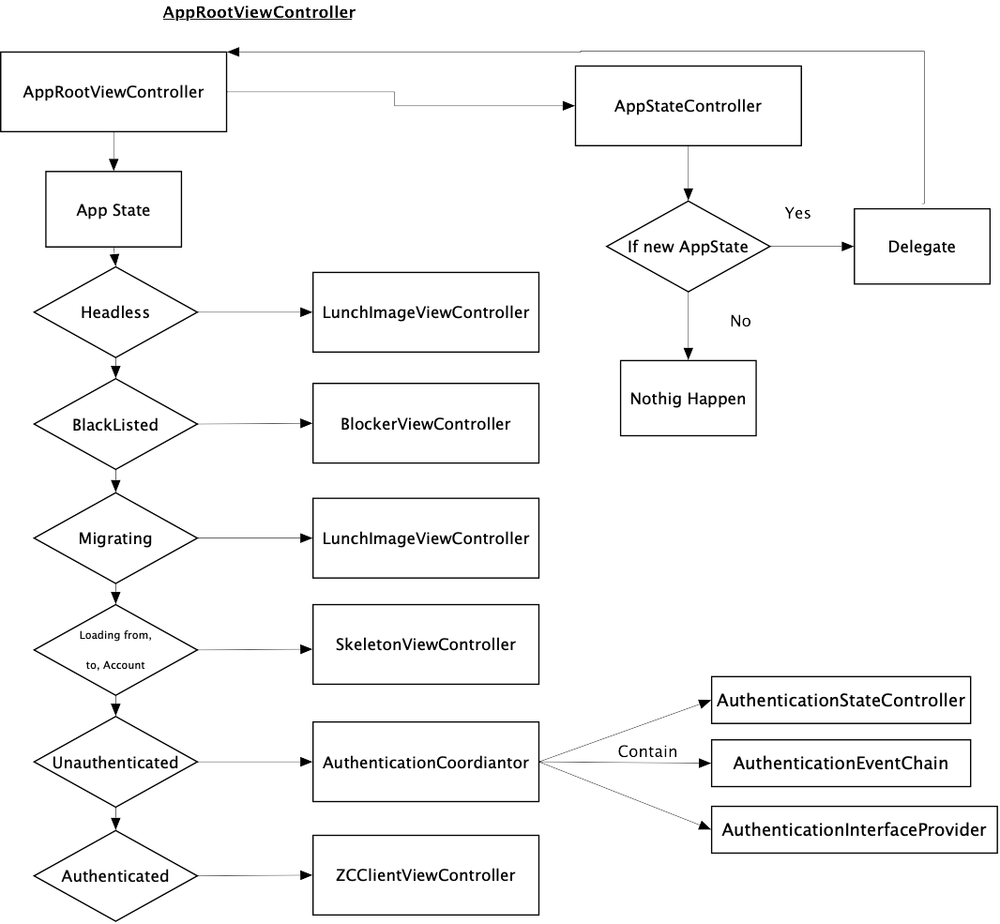

# RFC iOS UI Layer Refactoring

## Table of Contents

- [RFC iOS UI Layer Refactoring](#rfc-ios-ui-layer-refactoring)
  - [Table of Contents](#table-of-contents)
  - [Introduction](#introduction)
    - [Codebase Readability](#codebase-readability)
    - [Codebase Regressions](#codebase-regressions)
    - [Fragile Behavior When Running](#fragile-behavior-when-running)
    - [Code Hard to Re-Use](#code-hard-to-re-use)
    - [Work In Parallel](#work-in-parallel)
    - [Hard to Unit Test](#hard-to-unit-test)
    - [Chosen Pattern: VIPER](#chosen-pattern-viper)
  - [Refactoring Approcches: Top-Dowm and Bottom-Up](#refactoring-approcches-top-dowm-and-bottom-up)
    - [Top-Dowm and Bottom-Up for wire-ios Refactoring](#top-dowm-and-bottom-up-for-wire-ios-refactoring)
  - [Refactoring Part 1: AppRoot Routing](#refactoring-part-1-approot-routing)

## Introduction

At the top of the hierarchy in the [dependencies graph](https://github.com/wireapp/wire-ios/wiki) of the iOS application there is the **wire-ios** layer, which represents the user interface layer of the app. At the time when the UI layer started to be implemented the **Model-View-Controller** pattern (also known as `Massive-View-Controller`) was a widely used design pattern for architecting software applications. In fact Cocoa applications were centered around **MVC** and many of Apple's frameworks are impregnated by the pattern.

- **Model** is where your data resides. Things like persistence, model objects, parsers, managers, and networking code live there.
- **Views** presents data to the user and handles user interaction. It only knows how to present data to the user and it doesn't know or understand what it's presenting.
- **Controller** controls all logic that goes between the `View` and the `Model`. It transports messages between the `View` and the `Model`, and vice versa.

On iOS the **View** and the **Controller** are often merged in a unique class: the **UIViewController**. Every class that subclass it has the following duties:

- Calling the `business logic` and bind the results to the view managing the view elements.
- `Transforming the data` coming from the model layer into a UI friendly format.
- Navigation logic.
- Manage the UI state.

This produces single overstuffed and fat view controller classes and it breaks the **Single Responsibility Principle**. 

A good architecture enables the team to easily and safely change code without a ton of risk. Making changes to code in a codebase that's not architected well is expensive and risky. The two primary problems that good architecture practices solve are **slow team velocity** and **fragile code quality**. Additionally, good architecture practices can help you prevent rigid software.
A good app architecture enables the team to deliver features and bug fixes faster without compromising on `quality`. On the other hand, a less-than-ideal architecture slows the team down and makes your codebase very difficult to change without breaking existing functionality.
The tipical issues that a team encounters in a `slow velocity and fragile code quality` are:

- App's codebase sometimes causes regressions.
- App exhibits fragile behavior when running.
- The code is hard to re-use.
- Teammates step on each other's toes.
- Codebase is hard to unit test.

Each of these problems can be caused by two fundamental root causes: **highly interdependent code** and **large types**. In fact the more the team tightly couples parts of the codebase, the more likely something unexpectedly breaks when making code changes. Moreover **large types** such as `classes`, `structs`, `protocols` and `enums` that have long public interfaces and very long implementations, often hundreds or even thousands of lines of code, will cause to the team many problems and it will effect the code's quality. So breaking large types into **smaller types** is a great way to improve the codebase's architecture.

### Codebase Readability

As we already mentioned long lines view controllers are very difficult to understand. A good architecture breaks large chunks of code into small, modular pieces that are easy to read and understand. The more an architecture encourages locally encapsulated behavior and state, the easier the code will be to read. 

Moreover it is important to understand how many global variables the codebase has, and how many objects are instantiated directly in another object.
This means that, the more your objects directly depend on each other and the more your objects depend on global state, the less information a developer will have when reading a single file and this makes it incredibly difficult to know how a change in a file might affect code living in another file.

### Codebase Regressions

Sometimes changing the project's codebase causes regressions. The main architectural cause for this problem is `highly interdependent code`. it is difficult to notice easily the effects of code changes when the codebase is highly interdependent. 
This situation really slows the team down because any time any feature is built or any bug is fixed there's a chance for something to go wrong. If something does go wrong, it might be not immediate to figure out the root cause. In a really fragile codebase, the `change-break-fix cycle` can go out of control and the team can end up spending more time fixing issues than improving the app. This is not just a team velocity problem, it is especially a `code quality problem`. The chances of introducing a bug is much higher when the connections between code are hard to see and understand. Code that's hard to understand leads to code that easily breaks when changed.

Ideally, a team menbers should be able to easily reason about how the current file he/she is editing is connected to the rest of the codebase. The best way to do this is to **limit object dependencies** and to make the required dependencies obvious and visible.

### Fragile Behavior When Running

`Multi-core programming` contribute to the complexities involved in building iOS apps. Consequently, apps are susceptible to problems that are hard to diagnose such as race conditions and state inconsistency. For example, the App might have crashes due to a race condition associated with some mutable state. This kind of crash can take days to diagnose and fix. Good architecture patterns attempt to address these kinds of issues by designing constraints that help teams avoid these common issues.

### Code Hard to Re-Use

The structure of a codebase determines how much code the team can re-use. The structure also determines how easily the team add new feature to existing code.
`Large types` can prevent your code from being reusable. In fact, a huge and fat class is unlikely to be reusable because the team might only need part of the class and the part the team need might be tightly coupled with the rest of the class, making the part impossible to use without the rest of the class. Types that are smaller and that have less responsibility are more likely to be reusable.

By the way reusability is not just about being able to re-use code. It's also about being able to move code around when making changes to the app. The more reusable everything is, the easier it is to shuffle code around without needing to do risky refactors.

### Work In Parallel

The architecture also impacts how easily you can work in parallel with your teammates. When a codebase doesn't allow developers to work in parallel, team merbers either accidentally step on each others toes or waiting for a start committing code again. Ideally, a codebase has small enough units that each team member can write code in a separate file while building a feature. 
This is where a good architecture comes into the picture. Design an app architecture that allows developers to build features in isolation, an architecture that couples each feature into separate Swift modules. 
To summarize, the team will be able to build features much faster if the app's architecture allows it to easily parallelize work.

### Hard to Unit Test

When a codebase is made up of parts that are tightly coupled together  is notoriously hard to unit test. This makes the different parts impossible to isolate during test. For instance using the **MVC** pattern the problem might not be evident until it comes to the unit testing. Since your view controller is tightly coupled with the view, it becomes difficult to test because you have to be very creative in mocking views and their life cycle, while writing the view controller’s code in such a way, that your business logic is separated as much as possible from the view layout code.

### Chosen Pattern: VIPER

As we mentioned previously we use architectures in software development to organize our code into different layers, in order to make it cleaner, easier to test, to maintain and to write less boilerplate code.

The word [VIPER](https://github.com/wireapp/ios-architecture/blob/wire-ui-architecture-refactoring/UI-architecture-refactoring/UI_Refactoring.md) is a backronym for **View**, **Interactor**, **Presenter**, **Entity**, and **Routing** and it’s basically an implementation of a [Clean Architecture](https://blog.cleancoder.com/uncle-bob/2012/08/13/the-clean-architecture.html) for iOS applications, which is based on the [Single Responsibility Principle](https://medium.com/@severinperez/writing-flexible-code-with-the-single-responsibility-principle-b71c4f3f883f), in fact **Clean Architecture** divides an app’s logical structure into distinct layers of responsibility. This makes it easier to isolate dependencies and to test the interactions at the boundaries between layers.

- **View** It's the `interface layer`, which means `UIKit` files, mostly `UIViewController` subclasses and all the other stuff. `Views` don't do anything that's related to business logic, they're just a presentation and event forwarding layer which is used by the presenter. SO its sole responsibility is to display what the Presenter tells it to, and handle the user interactions with the screen. When the user triggers any event that requires processing, the `View` simply delegates it to the Presenter and awaits for a response telling it what should be displayed next.

- **Interactor** It is responsible for retrieving data from the model layer, and its implementation is completely independent of the user interface. 
So the `Interactor` contains all the business logic related to the entities and should be completely independent of the user interface.
Once the `Interactor` finishes running some task, it notifies the `Presenter` about the result obtained.
It's important to remember that data managers like network and database are not part of **VIPER** and they are treated as separate components (services), coming outside from the VIPER module. 
The `Interactor` can prepare or transform data, that's coming from the service layer, but we will discuss more in detail this statement.
It is foundamental to highlight that the `Interactor` doesn’t know the `View`, so it has no idea how the data should be prepared for the view, that's the role of the `Presenter`.

- **Presenter** It's an UIKit independent class that gathers input from user interactions and directs data between the `View` and `Interactor`.
So basically it receives the data structures coming from the `Interactor`, applies view logic over this data to prepare the content, and finally tells the `View` what to display.
It's the core class of a **VIPER** module, because it communicates with the `Interactor` and calls the `Router` for `wire-framing`. 
It's the only class that communicates with almost all the other components. That's the unique job of the `Presenter`, so it should not know anything about `UIKit` or low level `data models`.

- **Entity** It contains basic model objects used by the `Interactor`.

- **Router** It contains the `navigation logic` of the application using `UIKit` classes. It receives input commands from the `Presenter` to say what screen it should route to. Also, the `Router` should be responsible for passing data from one screen to the other.

The iOS team decided to use **VIPER** cause it offers a lot of benefits if used in the right way and for the right project:
- Well suited for large and complex projects that grow over time by adding new features (Scalable Projects): Allow us to keep the project maintainable for the long term.
- Simple and easy to understand code by other developers of the team. Makes identifying bugs and errors easy, since each layer has its own responsibility (Single Responsibility Principle): depending on the error, we can know which layer is responsible for that error.
- Modular and well-organized project.
- Adding or removing features is easy.
- Reduce the load on controllers, which makes them light-weight.
- UI logic is separated from Business logic.
- Makes it easy to test and maintain the code.
- Composition of the project is based on use cases.

## Refactoring Approcches: Top-Dowm and Bottom-Up

The **top-down** and **bottom-up** models are information processing and knowledge management strategies, mainly concerning software.
In general, they are methodologies used to analyze problematic situations and build hypotheses suitable for their solution: the concept of problematic situation can be traced back to the most varied areas, such as the development of a computer program, the resolution of a mathematical problem and so on.

In the **top-down** model, a `general view of the system is formulated`, it means that its main purpose is described without going into detail about its parts. Each part of the system is subsequently `refined` (using `decomposition`, `specialization` and `specification`) adding more details to the initial design. Each new part thus obtained can then be refined again, specifying further details, as long as the complete specification is sufficiently detailed to validate the model.
So **top-down** is when you take the whole problem and break it down into smaller and smaller problems until you get to the bottom where you have lots of actual implementation details.
This means that in the **top-down** model, we start from the goal and from it the strategy is derived. Once the strategy has been specified, **it is essential to identify the necessary resources, specify the available ones and identify the missing resources, and propose each missing resource as a sub-objective or as a sub-problem in which each sub-objective requires a sub-strategy related to it**.

In contrast to the **top-down** model there is the **bottom-up** model, in which individual parts of the system are specified in detail, and then connected to each other forming larger components, which are in turn interconnected to create a complete system.
So **bottom-up** is when you create lots of small, detailed building blocks that are generally useful and that can be assembled together to solve larger and larger problems.

In the software development process, **top-down** and **bottom-up** approaches play a fundamental role. The **top-down** approach emphasizes planning and a complete understanding of the system. **It is obvious that no coding can begin until at least a sufficient level of detail has been achieved in the design of a significant part of the system**. The **bottom-up** approach emphasizes coding and testing. This approach, however, has the risk that modules can be developed without having a clear idea of ​​how they should be connected to other parts of the system. On the other hand, the *reusability* of the code is one of the main benefits of the **bottom-up** approach.

**Modern approaches to software design typically combine both top-down and bottom-up techniques**. Although understanding the complete system is typically considered necessary for good design that theoretically leads to a **top-down** approach, it is fondamental in software projects try to make use of existing code at some levels. The existing modules give the design a **bottom-up** trend. So when re-designing a whole system both approaches are important. Initially the **top-down** approach will give you a logical structure specific to the application. Once that has been achieved the **bottom-up** can be applied where the low-level specifics are addressed.

### Top-Dowm and Bottom-Up for wire-ios Refactoring

If we think to the structure of the UI layes of the iOS App we could image it as a **screen tree**. Every screen is represented by a **leaf**. The composition of the leafs and the routing from one leaf to another builds the entire UI layer. In addition, every leaf has is own `cardinality` that determines the numeber of paths that a user can run across to reach that particular screen. 
Also there are leafs the forms the `core of the application` such as the `login`, `registration flow`, `tabbar`, `search`, `conversation list`, `conversation` and other leafs that are more external in the tree such as `settings`, `create group`, `user profile`, `contact profile`, `device list` and so on.

At this point we have two different ways to approch the **wire-ios** refactoring:

1) Refactring every leaf separatly starting from the more external ones to the more internals (**bottom-up** approch).

2) Reafctoring starting from the core leafs  and then adding step by step more details to the initial design represented by the external leafs (**top-down**).

Now, which one between the **top-down** (2) and **bottom-up** (1) approaches is the right one to refactor the **wire-ios** layer? 
The answer is: **both of them**. The basic idea is having **two seprated resources** (of group of resources) working on the refactring. One resource will develop the core leafs while the other resource will work on the more external leafs.

Moreover, as we already mentioned before a foundamental aspect of the **top-down** approch is the following: **it is essential to identify the necessary resources before start coding**. This concept must be applyed to all the leafs of the tree. 

The iOS team could start to design the modules, creating some kind of graph that can break the app into groups of features and screens, and illustrate roughly the flows between those features and screens. In this way it could be build an high-level
starting point that could be figured out by reverse engineering, whether that is using the app or looking at some code when needed.
The iOS team will also take care to highlight the point that are not clear and ask them to the **product team**.

On the other hand it will be very important receive the spects and documents (when present) from the **product team** in order to enrich the content of the informtion extrapolated with the reverse engineering.

Once we have enough information on a leaf we will proceed with the writing of detailed tickets where the main **acceptable criteria** will be described and only after this phase the developer will proceed to develop the leaf.

## Refactoring Part 1: AppRoot Routing

The iOS team decided to split the **wire-ios** refactoring in many chunks and since a line of refactoring will be done using the **top-down** approach, we thought that the most natural way to start it, is that the first part to be refactored should be the **AppRoot Routing**. In the next picture it is shown the current architecture for the **wire-ios** app root routing.

The **AppRootViewController** is the class that coordinates the routing at the launch of the Wire iOS App. It has an instance of the **AppStateController** which represents the class that calculate the current **AppState** of the appllication. Everytime that the **AppState** changes the **AppRootViewController** will be informed from the **AppStateController** through the delegation pattern. The **AppState** has six different values:

   - **HeadLess**: it is the initial state and in this case it is shown the launching screen.
   - **BlackListed**: it is the state when the user is black listed and in this case it is shown the blocker screen.
   - **Migrating**: it is the state  the the session manager is migrating the legacy account and in this case it is shown the launching screen.
   - **Loading from, in Account**: it is the state when a user is changing from and account to another and in this case the skeleton screen is shown. 
   - **Unauthenticated**: it is the state when no user is authenticated, we can see more in details this state in the second part of the following image.
   - **Authenticated**: it is the state when an user is already authenticated and in this case it is shown or a conversation screen if the last time that the app was close a conversation was opened or the conversation list screen if no conversation was already opened.

As we alredy mentioned before, when at the launch of the app no user is not authenticated the routing of the app is managed by **AuthenticationCoordinator**. Here is controlled the routing regarding the login and rgistration flow. The **AuthenticationCoordinator** has an instance of the **AuthenticationStateController**. The **AuthenticationFlowStep** represent a step on the login or registration process. Everytime a new **AuthenticationFlowStep** is instaciated, the **AuthenticationStateController** will inform the **AuthenticationCoordinator** and a new screen is shown. A central class is the **AuthenticationEventResponderChain**, it handles all the event regarding the login and registration flow. Everytime that an event is fired the **AuthenticationEventResponderChain** will propagate it to the **AuthenticationCoordinator**.

After analizing the current app routing flow the iOS team has decided to leave more or less unchanged the part regarding **AppRootViewController**. On the other hand we decided to complete refactor the part regarding the case when the app state is equal to **Unauthenticated**. The idea is not to centralize the navigation in one class like in the **AuthenticationCoordinator** but to decouple it in a way that the current screen visible router class will take care of the navigation for the next step in the login or registration flow.